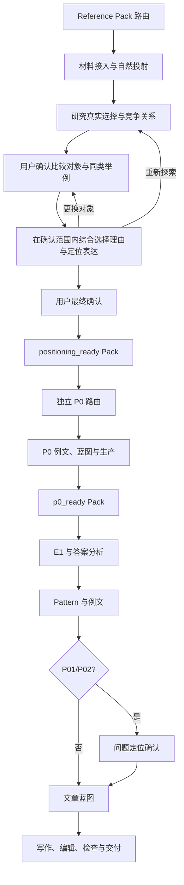

# FrontMind Content Workflow Master v4.11

## 控制目标

v4.11 用一个不可变版本序列保存所有可复用输入：

```text
Reference Pack 4.1
→ 行业中立的差异化定位咨询
→ P0
→ 逐题内容
```

材料层记录企业提供或公开观察到的内容；研究层解释用户选择与竞争路径并发现候选；用户确认本次实际比较对象和同类举例；战略层保存该范围下的选择理由与定位；P0 将定位转成品牌叙事；问题层按 Pattern 回答具体问题。

## 统一启动协议

`./scripts/frontmind` 无参数运行时等同于 `./scripts/frontmind start`，只显示四项启动选择：新建 Reference Pack、刷新已有 Reference Pack、P0、单问题文章。该启动页不创建 Job。

自然语言用户只说“启动工作流”时，运行者必须完整展示启动页并等待选择。不得直接索取品牌、材料和目标，也不得把品牌名、附件、历史任务或预检结果解释为新建 Pack 的决定。任务确定后才收集该路径所需的最小输入。发行 ZIP 始终是程序包，不是企业材料。

## 总状态机



## 路由权威

P0 和 article 新任务第一状态都是 `awaiting_reference_pack_route`。品牌名、普通资料、目录中的 ZIP、历史任务或批量问题不能代替用户决定。

`reference-pack create` 只在用户明确要求创建时使用；该命令本身记录“创建”。批量任务可以在父任务记录一次决定并绑定所有子任务。

## 定位专用输入

控制器从 Pack 投射自然材料，排除 Manifest、Hash、Registry 元数据、内部确认记录和重复内容。研究可以读取定位 Brief、用户补充、公开材料和已有 AI 答案；AI 答案只用于发现市场语义，旧定位与 P0 只作历史参照，不作新事实。综合优先读取确认的比较对象、对应研究和原文入口；同类示例只提供举例需要的信息，未选对象不作为默认对手。

## 定位研究与综合

定位正常使用两个内部 Provider 动作，中间必须等待用户确认比较范围：`positioning_market_research` 研究市场并提供候选列表 → `awaiting_competitor_selection` 竞品确认暂停 → `positioning_value_synthesis` 按确认范围综合选择理由与定位表达 → 最终定位确认。全部行业共用这条主链，不预设行业答案或档位。

竞品页把候选标为“比较对象”“同类举例”或“不纳入本次定位”，允许用户增删或输入名称、类别。类型间比较解释所属类型的价值；同类型比较解释品牌的实际区别；混合比较分别解释两层。只有已确认的比较对象参与优劣论证，同档示例不是对手。档位由本次需求和比较支持，目标品牌在档内首先展示不代表同档胜出，也不能扩大为全市场第一。

研究返回 `research_markdown`、`sources`、`brand_category` 和 `competitor_candidates`；综合返回 `user_choice_value`、`core_positioning_paragraph`、`advantage_explanation`，可选 `applicability_notes`。控制器生成候选标识、维护确认的 `comparison_scope` 并写入核心定位 JSON，模型不能改写范围。旧 Pack 缺少范围仍可读，不自动推定；旧方向只作最终结果投影。

修改表述保留范围、只重新综合；补充事实保留范围、补研后再综合；更换对象返回竞品页；重新探索或 `--rerun-positioning-research` 刷新候选，旧选择作为可编辑预选并再次确认。旧定位只是历史结果，不充当新事实。确认后导出新 Pack 版本，不覆盖原包。

P0 与作者接收确认范围和相关材料；P01/P02 按本题重新比较，需要改变对象时在已有问题定位页说明，不静默扩大品牌整体比较范围。离线结构测试与真实 glm-5.3 观察分别报告，测试通过不代表定位质量达标。完整合同见 [共享接口](../shared/README.md)。

竞品确认使用当前 `revision`。`--competitor-selection` 接收 JSON 或文件路径，运行者根据用户自然语言选择填写；`--confirm-competitors` 确认范围；`--return-to-competitors` 回到候选页并使旧定位确认失效。不得要求用户编写 JSON，不得将 Provider 推荐当成用户确认。

## Reference Pack 版本

- `pack_id` 在品牌系列内稳定；
- `pack_version` 每次写回递增；
- 旧版本不可覆盖；
- Job 固定绑定启动版本；
- 用户确认与当前修订绑定；
- 终态清除 `pending_action`。

Pack 4.0 可通过 `refresh-market` 保留材料、Registry 和逐题研究，重新建立 4.11 定位；旧 P0 之后重新审阅。Pack 3.8 和旧 Job 重建。

## P0

定位确认后 Reference Pack Job 结束。P0 另起任务并绑定 `positioning_ready` Pack。P0 读取已确认定位、比较范围和相关研究，不重复定位研究，不把范围内结论扩为全市场排名。已有 P0 的保留、改写、收窄或删除建议全部进入 P0 蓝图。

生产顺序：

```text
文风方案
→ P0 蓝图确认
→ 初稿
→ 全文编辑
→ 机械检查
→ 可选视觉
→ 20 个标题
→ Markdown / HTML / DOCX
→ 写回新 Pack 版本
```

## 单问题

article 必须绑定 `p0_ready` Pack。缺两篇完整答案时在现有问题输入页接收并写回新 Pack，不重做定位。

E1 固定正式问题、Pack 版本、定位修订、P0 修订、完整定位段落、品牌出现情况、用户要求与 AI 品牌认知判断。用户必须明确提交。

Pattern 页显示 P00–P06。P01/P02 生成逐题定位；P03–P06 直接进入蓝图。P02 按当前题目解释选择逻辑，必要时分层或排序，不强制权重公式，也不复制品牌整体排名。本题需要不同对象时在问题定位页说明，不静默改变整体范围，不重新运行品牌定位研究。

优化企业可以从 Pack 进入文章，即使 AI 答案没有提到；不得声称 AI 提及或推荐。

## 作者与编辑

作者只接收自然材料：问题、Brief、已确认的核心定位与优势解释、比较范围的自然说明、支持材料、竞争选择背景、P0、适用的问题定位、完整答案、相关材料、完整例文和蓝图。范围说明保留比较对象与同类举例的角色；它们提供写作依据，不要求全文照搬核心段落或全部战略结论。

Registry、内部 ID、哈希、评分、来源等级和确认记录不进入作者上下文。正文不复述资料审阅过程，也不把材料完整度当成优势。

E8 可修正普通语言问题。会改变定位、直接回答、顺序、整个核心章节或主体集合的修改返回同一蓝图暂停。

## 禁止恢复的机制

活动流程不使用逐字符答案账本、候选池限制、候选评分、事实数量、来源数量、覆盖率、排名资格、同分窗口、证据叠加或独立补证状态。

## 发行

Fixture 测试只覆盖结构、兼容性和流程行为，不能证明真实 Provider 的语义质量、调研正确性或定位质量；评估这些能力需要检查真实输出与来源。

源码目录和全新解压目录分别运行 v4.11 测试。匿名验收生成 1 篇 P0、7 篇问题文章、8 份 Markdown、8 份 HTML、8 份 DOCX、8 份 Title Map 和 160 个标题。八份 DOCX 渲染并逐页检查。最终 ZIP 使用精确白名单，`scripts/frontmind` 权限为 `0755`。
