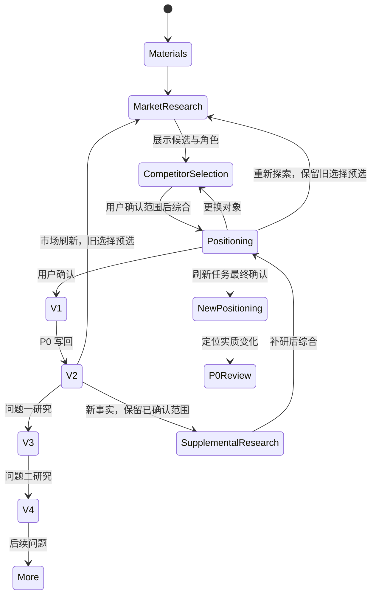

# Reference Pack 4.1 架构

## 1. 设计目标

Reference Pack 4.1 是 FrontMind Runtime 4.11 的唯一持久内容包。它统一保存：

1. 企业和公开材料；
2. 内部来源追踪；
3. 行业中立的用户选择与竞争路径研究；
4. 用户确认的比较范围与完整核心定位；
5. P0；
6. 逐题研究。

材料观察与战略选择保持分层。所有更新生成不可变新版本，运行中的文章不会静默切换输入。

## 2. 包结构

```text
Reference_Pack/
├── reference_pack.json
├── materials/
│   ├── index.json
│   └── ...
├── registries/
│   ├── source_registry.json
│   ├── knowledge_registry.json
│   ├── claim_registry.json
│   └── image_registry.json
├── research/
│   ├── brand_market/
│   │   ├── positioning_research_review.md
│   │   ├── competitive_choice_map.json
│   │   ├── competitive_choice_map.md
│   │   ├── brand_reality.md
│   │   ├── audience_choice_logic.md
│   │   ├── competitor_landscape.md
│   │   ├── market_opportunities.md
│   │   ├── ai_semantic_context.md
│   │   └── source_index.json
│   └── question_research/
│       └── ...
├── strategy/
│   ├── positioning_brief.md
│   ├── positioning_directions.json
│   ├── positioning_direction_decision.json
│   ├── core_positioning.md
│   ├── core_positioning.json
│   ├── positioning_writing_guidance.md
│   └── core_positioning_confirmation.json
└── p0/
    ├── p0_brand_article.md
    ├── p0.html
    ├── p0.docx
    ├── p0_title_map.json
    └── p0_record.json
```

Registry 服务于维护和来源追踪，不进入定位作者或文章作者上下文。

## 3. 根索引与 readiness

```json
{
  "schema_version": "4.1",
  "profile": "frontmind-content-reference-pack",
  "pack_id": "rp_0123456789abcdef",
  "pack_version": 2,
  "parent_pack_version": 1,
  "brand_name": "示例品牌",
  "readiness": {
    "materials_ready": true,
    "brand_market_research_ready": true,
    "positioning_ready": true,
    "p0_ready": true,
    "question_ready": {
      "q000001": false
    }
  }
}
```

- `materials_ready`：材料安全接入并建立索引与 Registry；
- `brand_market_research_ready`：竞争选择研究动作完成，不代表达到来源数量门槛；
- `positioning_ready`：当前完整定位修订已经用户确认；
- `p0_ready`：P0 已写入当前 Pack；
- `question_ready`：对应问题具备两篇完整 AI 答案和结构合法的问题输入。

Readiness 是生产阶段状态，不是评分。

## 4. 定位专用材料投射

研究 Provider 不直接读取 Registry、Manifest、Hash、确认 ID 或材料审计字段。控制器从 Pack 投射：

- 完整企业自然材料；
- 定位 Brief；
- 用户补充文字或文件；
- 已有 P0（刷新场景，只作为历史内容，不作为新事实依据）；
- 公开来源标题和链接；
- 可用于发现语义的完整 AI 答案。

去除重复文本，但不把材料压缩成事实编号。

## 5. 两个动作与竞品确认的数据流

定位正常使用两个内部 Provider 动作，中间必须等待用户确认比较范围：`positioning_market_research` 研究市场并提供候选列表 → `awaiting_competitor_selection` 竞品确认暂停 → `positioning_value_synthesis` 按确认范围综合选择理由与定位表达 → 最终定位确认。全部行业共用这条主链，不预设行业答案或档位。

竞品页把候选标为“比较对象”“同类举例”或“不纳入本次定位”，允许用户增删或输入名称、类别。类型间比较解释所属类型的价值；同类型比较解释品牌的实际区别；混合比较分别解释两层。只有已确认的比较对象参与优劣论证，同档示例不是对手。档位由本次需求和比较支持，目标品牌在档内首先展示不代表同档胜出，也不能扩大为全市场第一。

研究返回 `research_markdown`、`sources`、`brand_category` 和 `competitor_candidates`；综合返回 `user_choice_value`、`core_positioning_paragraph`、`advantage_explanation`，可选 `applicability_notes`。控制器生成候选标识、维护确认的 `comparison_scope` 并写入核心定位 JSON，模型不能改写范围。旧 Pack 缺少范围仍可读，不自动推定；旧方向只作最终结果投影。

修改表述保留范围、只重新综合；补充事实保留范围、补研后再综合；更换对象返回竞品页；重新探索或 `--rerun-positioning-research` 刷新候选，旧选择作为可编辑预选并再次确认。旧定位只是历史结果，不充当新事实。确认后导出新 Pack 版本，不覆盖原包。

P0 与作者接收确认范围和相关材料；P01/P02 按本题重新比较，需要改变对象时在已有问题定位页说明，不静默扩大品牌整体比较范围。离线结构测试与真实 glm-5.3 观察分别报告，测试通过不代表定位质量达标。完整合同见 [共享接口](shared/README.md)。

## 6. 市场对象

`competitive_choice_map.json` 路径保留。轻量内容为 `research_markdown`、`sources`、`brand_category`、`competitor_candidates` 和控制器元信息。`brand_category` 表示目标品牌本轮的可比类别；候选包含名称、类别、对象类型、研究说明及相关来源，选择用标识由控制器生成。候选不等于用户已经选定的对手。现有研究 Markdown 成员保存同一自然研究的兼容视图，不生成虚构档位。

## 7. 核心对象

`core_positioning.json` 保存三个必需正文字段及可选说明。控制器将用户确认的 `comparison_scope` 写入该对象，记录实际比较对象、同类举例与范围说明；综合模型不负责生成或改变范围。该字段随现有核心对象导出，不增加旧 Pack 必需的独立文件。旧完整结构可读取，元信息由控制器维护。

## 8. 兼容读取

Schema 使用旧完整结构与新轻量结构的兼容分支。正文和上下文读取按存在内容展示，不能把旧缺字段补成首位。旧已确认 Pack 缺少 `comparison_scope` 仍可读，不凭原文、顺序或旧示例自动推定范围；需要重新生成定位时通过现有刷新入口确认范围。旧方向仅为兼容投影，不参与新的定位推导。

## 9. 版本状态转换



`pack_id` 在品牌系列内稳定，`pack_version` 每次提交递增，`parent_pack_version` 指向直接父版本。

## 10. 更新传播

| 更新 | 定位 | P0 | 问题研究 |
|---|---|---|---|
| 新增具体问题答案 | 保持 | 保持 | 新增或更新指定问题 |
| 更新问题引用数据 | 保持 | 保持 | 更新指定问题 |
| 新增普通品牌材料 | 保留范围，补研后再综合并确认；无范围先确认竞品 | 定位变化时审阅 | 保留 |
| 刷新市场研究 | 重做候选，旧选择预选，经竞品与最终定位确认 | 定位变化时审阅 | 保留 |
| 用户修改表述 | 保留范围，仅重新综合并确认 | 定位变化时审阅 | 保留 |
| 用户更换比较对象 | 返回竞品页，旧定位确认失效，重新综合并确认 | 定位变化时审阅 | 保留 |
| 只修格式或元数据 | 保持 | 保持 | 保持 |

修改表述返回最终定位页，更换对象和重新探索返回竞品页；不增加修改分类器或独立审批。P0 和作者接收范围的自然语言说明；P01/P02 如需不同对象，在已有问题定位页说明，不静默改写整体范围。

## 11. Pack 4.0 升级

`reference-pack refresh-market` 接受结构合法的 Pack 4.0：

1. 保留 `pack_id`、版本历史、材料、Registry 和问题研究；
2. 升级根结构为 4.1；
3. 清除旧市场定位、战略和 P0；
4. 运行 v4.11 市场研究并等待用户确认比较对象；
5. 在确认范围内综合定位，等待用户最终确认；
6. 生成下一版 Pack；
7. 后续单独审阅并写回 P0。

Pack 3.8 不能表达这一升级合同，需用原始材料重建。旧 Job 不原地迁移。

## 12. 校验边界

Schema 验证字段类型、对象结构、版本、允许值和旧字段的兼容结构。市场层不要求品牌响应链；保留的链字段在提供时按其结构验证。旧方向投影仍可表达 0–3 个方向、唯一主方向和最多一个辅助方向，不增加新的业务暂停。

新输出所需字段、候选选择的结构、Pack 成员与 readiness、当前修订确认、P0 所属系列和 Job 绑定版本由控制器及 Pack 校验负责。控制器维护比较范围，Schema 本身不执行研究、排序判断或用户确认。范围不作为旧 Pack 的必需新增字段。

Schema 不验证事实数量、来源数量、竞品数量、评分、覆盖率、排名资格或候选是否来自 AI 答案。Fixture 测试只证明结构、兼容性和流程行为，不证明真实 Provider 的语义质量、调研正确性或定位质量；这些需要审阅真实输出与来源。

## 13. 原子发布与 ZIP 防护

Builder 在同一父目录建立临时目录，流式复制父 Pack，写入变更，验证后生成临时 ZIP，再原子发布目录和 ZIP。任一步失败会回滚半成品。

ZIP：

- 不设置外壳字节上限；
- 不设置单成员字节上限；
- 不设置解压总字节上限；
- 最多 5,000 个成员；
- 拒绝重复规范化路径；
- 拒绝路径逃逸与绝对路径；
- 拒绝加密、嵌套 ZIP、符号链接和特殊文件；
- 单成员压缩比不得超过 200。
